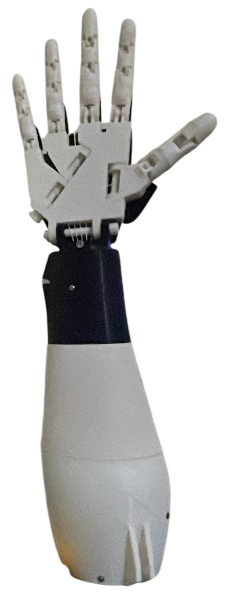
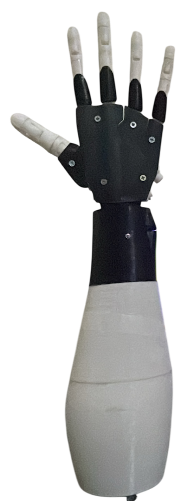

# RoboGames 2024 Competition Projects
Welcome to our RoboGames 2024 competition repository! This collection showcases our team's innovative robotics projects that participated in multiple categories at the prestigious RoboGames competition.
## Competition Overview
RoboGames is one of the world's largest robotics competitions, bringing together engineers, students, and robotics enthusiasts from around the globe. Our team participated in multiple categories, demonstrating advanced engineering capabilities and innovative design solutions.
## Competitions
### RoboGames-2024
### Humanoid Stair Climbing Competition
The competition challenged participants to design and operate humanoid robots capable of effectively climbing a staircase autonomously. The robot that participated in the competition featured a bipedal configuration composed of two legs and a main body. This design allowed for human-like movement and efficient navigation of the staircase.
**Design Highlights:**
- Bipedal Configuration: The two-legged design mimicked human walking, enabling the robot to handle complex terrain such as staircases with varying step heights and depths.
- Balance Maintenance: The robot successfully demonstrated the ability to maintain balance throughout the climb.

  <table>
    <tr>
      <td align="center">
        
      </td>
      <td align="center">
        
      </td>
    </tr>
  </table>

The humanoid demonstrated efficient performance in climbing the stairs without losing its balance during the climb. 

### Best of Show Competition
The Best of Show competition showcased innovative sign language translation technology that bridges communication gaps for the deaf and hard-of-hearing community. The robotic hand featured in this competition represents a significant advancement in assistive technology, capable of translating text input into accurate sign language gestures through sophisticated mechanical engineering and intelligent control systems.
**Design Highlights:**
- Articulated Finger Design: Each finger features multiple joints that allow for natural human like motion and precise sign language gestures.
- Modular Construction: The hand incorporates a modular design with distinct palm, finger, and wrist components for enhanced functionality.
- Text-to-Sign Language Translation: Advanced software interprets text input and converts it into corresponding sign language movements.
- Real-time Communication: The system enables seamless translation from written text to visual sign language representation.

  <table>
    <tr>
      <td align="center">
        
      </td>
      <td align="center">
        
      </td>
    </tr>
  </table>

The prosthetic hand demonstrated exceptional performance in translating text to sign language, showcasing smooth finger articulation and reliable functionality that accurately reproduces sign language gestures to facilitate communication accessibility.

