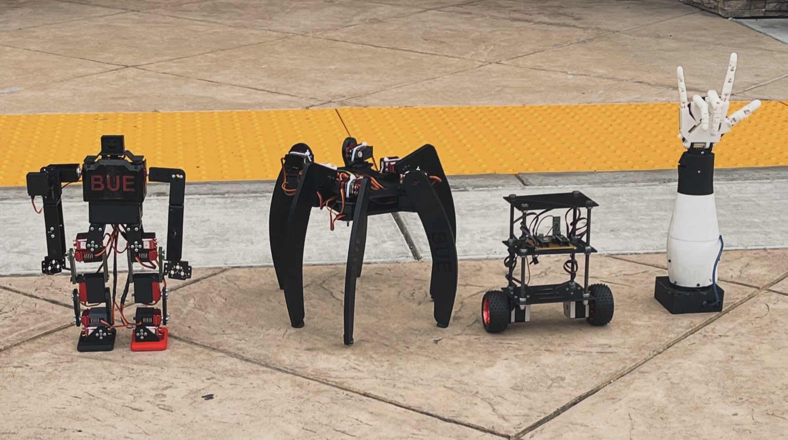

# 🤖 RoboGames 2024 Competition 

  
  
  
  **Welcome to our RoboGames 2024 competition repository!**
  
  *Showcasing innovative robotics projects that competed in multiple categories at the world's most prestigious robotics competition*
  
  
  
  
  

---

## 🏆 Competition Overview

**RoboGames** stands as one of the world's largest and most prestigious robotics competitions, uniting engineers, students, and robotics enthusiasts from across the globe. Our dedicated team showcased cutting-edge engineering capabilities and innovative design solutions across multiple competitive categories.

> *"Where the future of robotics comes to life through competition and innovation"*

---

## 🚀 Our Competition Entries

### 🦾 Humanoid Stair Climbing Competition

  
  
  

#### 🎯 Challenge Description
The humanoid stair climbing competition pushed the boundaries of autonomous robotics, challenging participants to design and operate humanoid robots capable of navigating complex staircase terrain without human intervention.

#### 🔧 Technical Specifications

<table>
<tr>
<td width="50%">

**🏗️ Design Architecture**
- **Bipedal Configuration**: Two-legged design mimicking human locomotion
- **Autonomous Navigation**: Self-directed stair climbing capabilities  
- **Adaptive Balance**: Dynamic stability control systems
- **Terrain Adaptation**: Handles varying step heights and depths

</td>
<td width="50%">

**⚙️ Key Features**
- Human-like movement patterns
- Real-time balance correction
- Efficient energy management
- Robust mechanical construction

</td>
</tr>
</table>

#### 📸 Visual Documentation

  <table>
    <tr>
      <td align="center" width="50%">
        
         <strong>🔍 Front View</strong>
         <em>Complete frontal perspective showing bipedal design</em>
      </td>
      <td align="center" width="50%">
        
         <strong>📐 Side View</strong>
         <em>Lateral view highlighting balance mechanisms</em>
      </td>
    </tr>
  </table>

#### 🏅 Performance Results
> **Outstanding Achievement**: The humanoid robot demonstrated exceptional stair-climbing performance, successfully maintaining balance throughout the entire ascent without any stability failures.

  
  
  

---

### 🤝 Best of Show Competition

  
  
  

#### 🎯 Innovation Focus
Our Best of Show entry revolutionizes communication accessibility through advanced sign language translation technology, creating a bridge between the hearing and deaf/hard-of-hearing communities using sophisticated robotic engineering.

#### 🔧 Technical Innovation

<table>
<tr>
<td width="50%">

**🤖 Mechanical Design**
- **Articulated Fingers**: Multi-joint design for natural movement
- **Modular Architecture**: Separate palm, finger, and wrist components
- **Precision Control**: High-accuracy gesture reproduction
- **Durable Construction**: Built for continuous operation

</td>
<td width="50%">

**🧠 Intelligent Systems**
- **Text-to-Sign Translation**: Real-time conversion algorithms
- **Gesture Recognition**: Accurate sign language interpretation
- **Seamless Communication**: Instant visual representation

</td>
</tr>
</table>

#### 📸 Design Documentation

  <table>
    <tr>
      <td align="center" width="50%">
        
         <strong>👋 Front Perspective</strong>
      </td>
      <td align="center" width="50%">
        
         <strong>🔧 Rear Assembly</strong>
      </td>
    </tr>
  </table>

#### 🏅 Impact & Performance
> **Breakthrough Achievement**: The prosthetic hand exceeded expectations in text-to-sign language translation, demonstrating fluid finger articulation and exceptional reliability in reproducing complex sign language gestures, significantly advancing communication accessibility technology.

  
  
  

---

  
  **Built with 💝 by our Robotics Engineering Team**
  
  *Pushing the boundaries of what's possible in robotics*
  
  ---
  
  ⭐ **Star this repository if our projects inspired you!** ⭐
  

